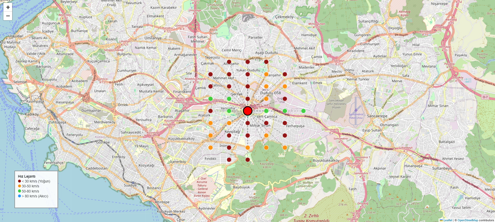

# 🚗 İstanbul Trafik Yoğunluğu Tahmini (Deep Learning)

Bu proje, İstanbul'un karmaşık trafik ağındaki hız değişimlerini öğrenerek gelecekteki trafik yoğunluğunu tahmin eden gelişmiş bir **Derin Öğrenme (Deep Learning)** projesidir. İBB Açık Veri Portalı'ndan alınan gerçek zamanlı sensör verileri kullanılarak, trafik akışı **Zamansal (Temporal)** ve **Mekansal (Spatial)** boyutlarda analiz edilmiştir.



## 🎯 Proje Amacı ve Kapsamı

Büyük şehirlerin en büyük sorunlarından biri olan trafik sıkışıklığını önceden tahmin etmek, hem bireysel sürücüler hem de şehir planlamacıları için kritik öneme sahiptir. Bu proje şunları hedefler:
*   Geçmiş trafik verilerinden anlamlı desenler (patterns) çıkarmak.
*   Belirli bir lokasyondaki (GeoHash) araç hızlarını **1, 3 ve 6 saat** sonrası için tahmin etmek.
*   Trafik ağındaki sensörler arasındaki mekansal ilişkileri analiz etmek.

## 🧠 Model Mimarisi ve Teknoloji

Projede zaman serisi tahmin başarısını maksimize etmek için **Bi-Directional LSTM (Çift Yönlü Uzun Kısa Süreli Bellek)** mimarisi tercih edilmiştir.

### Kullanılan Teknolojiler
*   **TensorFlow & Keras:** Derin öğrenme modelinin inşası ve eğitimi.
*   **Folium:** İnteraktif harita görselleştirmeleri.
*   **Pandas & NumPy:** Büyük veri işleme ve manipülasyonu.
*   **Scikit-Learn:** Veri ölçekleme (RobustScaler) ve performans metrikleri.

### Model Yapısı
1.  **Giriş Katmanı:** (Geçmiş 24 Saat, Özellik Sayısı) boyutunda zaman serisi verisi.
2.  **Bi-Directional LSTM (128 Hücre):** Zaman akışını hem ileri hem geri yönde analiz ederek karmaşık bağımlılıkları öğrenir.
3.  **Dropout (0.3) & BatchNormalization:** Aşırı öğrenmeyi (overfitting) engeller ve eğitimi stabilize eder.
4.  **Bi-Directional LSTM (64 Hücre):** Daha soyut özellikleri öğrenmek için ikinci katman.
5.  **Dense Çıkış Katmanı:** Gelecek 1, 3 ve 6 saatlik hız tahminlerini üretir.

## 📊 Model Başarısı ve Performans

Modelin başarısı **RMSE (Kök Ortalama Kare Hata)** ve **MAE (Ortalama Mutlak Hata)** metrikleri ile değerlendirilmiştir.

*   **Döngüsel Zaman Kodlaması:** Trafiğin gün içindeki (sabah zirvesi, gece sakinliği) ve haftalık (hafta içi vs hafta sonu) döngülerini modelin daha iyi anlaması için saat ve gün bilgileri Sinüs/Kosinüs fonksiyonları ile dönüştürülmüştür.
*   **Mekansal Filtreleme (Spatial Awareness):** Sadece tek bir nokta değil, o noktayı etkileyebilecek en yakın **40 komşu sensörün** verisi de modele girdi olarak verilmiştir. Bu sayede trafik sıkışıklığının bir noktadan diğerine yayılması (spatial propagation) modellenebilmiştir.

*Model, özellikle ani hız değişimlerini ve yoğun saat geçişlerini başarıyla takip edebilmektedir.*

## 🗺️ Görselleştirme

Proje çıktıları sadece sayısal değil, görsel olarak da zengindir:
*   **`traffic_network_map_renkli.html`:** Trafik sensör ağını, merkez noktayı ve komşuluk ilişkilerini gösteren interaktif harita. (Bu dosyayı tarayıcınızda açarak inceleyebilirsiniz).
*   **Performans Grafikleri:** Eğitim kaybı, tahmin vs gerçek değer karşılaştırmaları ve hata dağılımları otomatik olarak üretilir.

## 📂 Dosya Yapısı

*   `istanbul_traffic_prediction.py`: Ana model, eğitim ve tahmin motoru.
*   `create_map.py`: Coğrafi veriyi işler ve ağ haritasını oluşturur.
*   `visualize_results.py`: Gelişmiş grafik ve analiz modülü.
*   `image.png`: Model sonuç örneği / sistem görüntüsü.
*   `traffic_network_map_renkli.html`: Oluşturulan interaktif trafik haritası.

## 🚀 Kurulum

```bash
# Gerekli paketleri yükleyin
pip install pandas numpy matplotlib seaborn folium tensorflow scikit-learn

# Haritayı oluşturun
python create_map.py

# Modeli eğitin
python istanbul_traffic_prediction.py
```

## 👨‍💻 Yazar
**Özge Mellaş**  
GitHub: [ozgemellas](https://github.com/ozgemellas)
